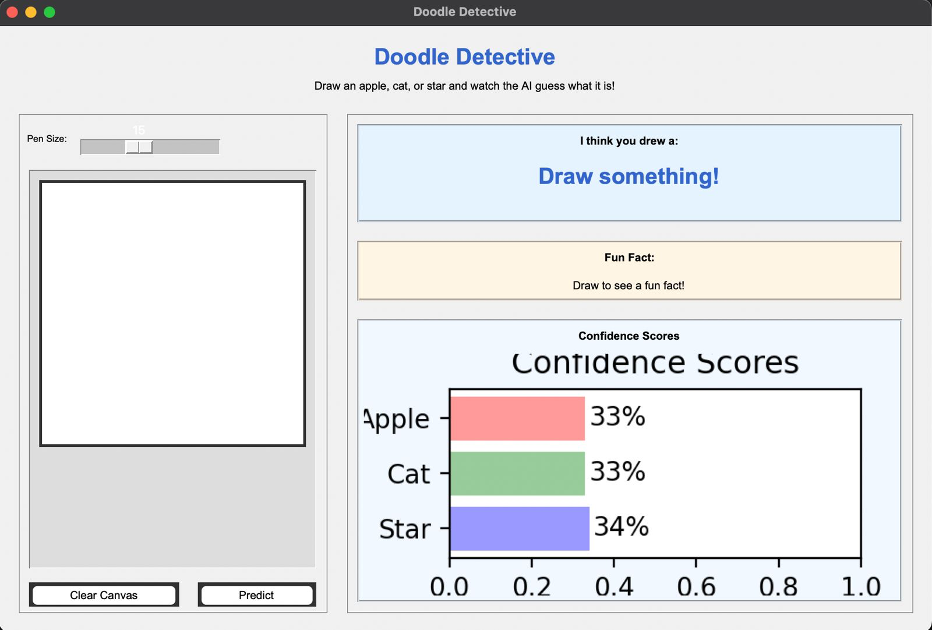
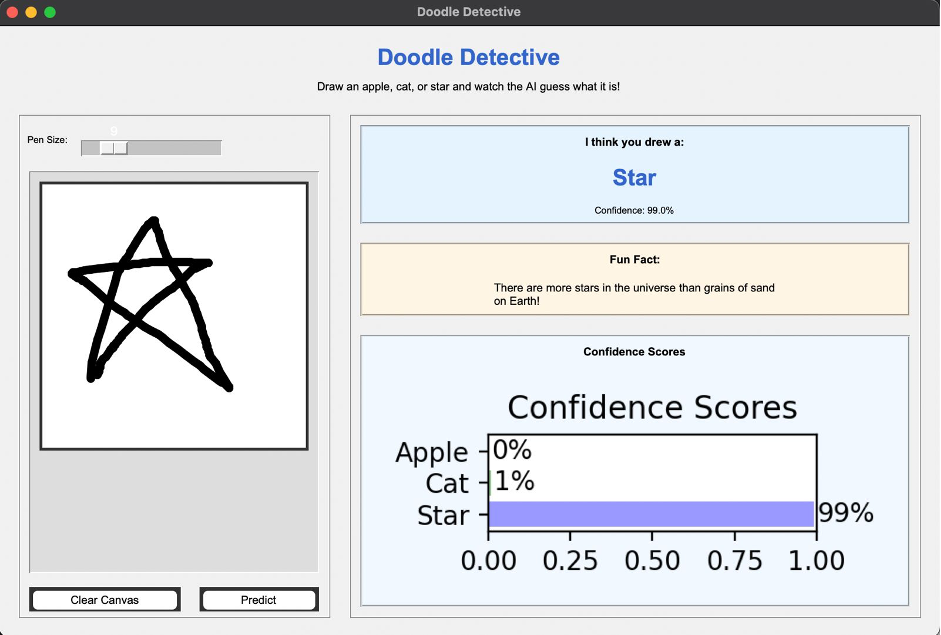
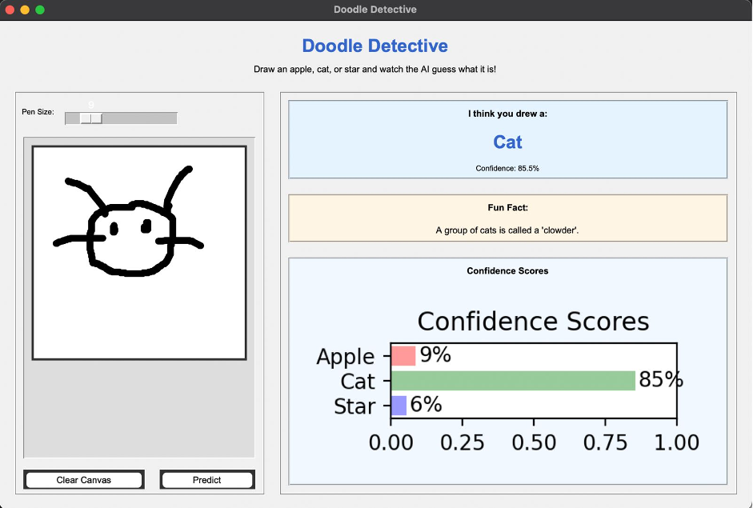
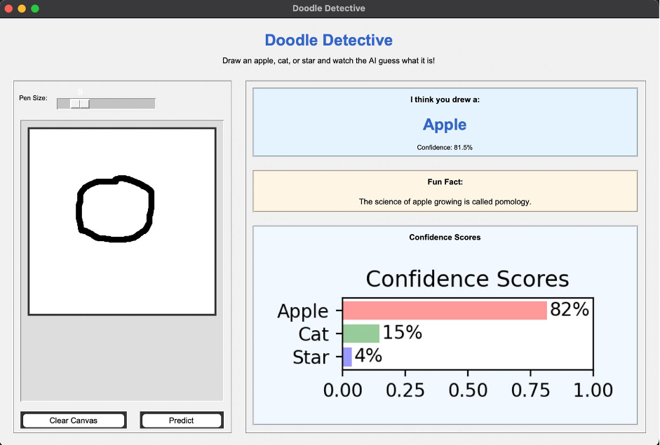
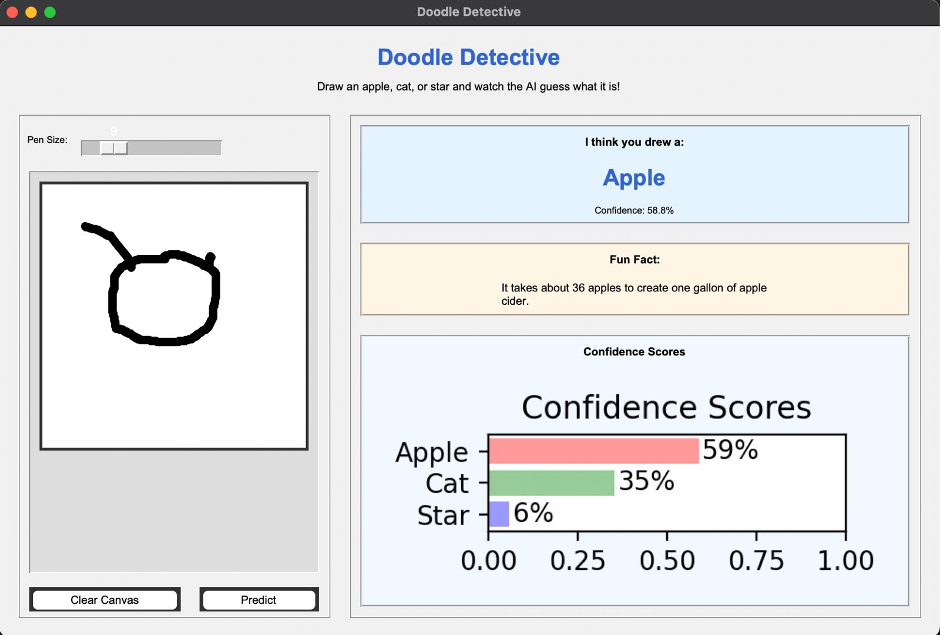

# Doodle Detective 🎨🔍

[](https://www.python.org/)
[](https://www.tensorflow.org/)
[](LICENSE)

**An end-to-end deep learning project that classifies hand-drawn doodles using a Convolutional Neural Network and a desktop GUI built with Tkinter.**

> This was my first deep learning project and explores the complete workflow from dataset preparation and CNN training to deploying a trained model in a desktop application.

---

## Screenshots

| Drawing Canvas | Prediction Result | Confidence Chart |
|:---:|:---:|:---:|
|  |  |  |
| Complete application interface | Draw an apple, cat, or star | Bar chart shows model confidence per class |

| Full Interface | Drawing Examples |
|:---:|:---:|
|  |   |
| The complete Doodle Detective window | The model classifies all three supported shapes |

---

## Overview

Doodle Detective lets you draw an **apple**, **cat**, or **star** on a canvas, and a CNN trained on the QuickDraw dataset predicts what you drew — in real time, with confidence scores, fun facts, and drawing statistics.

| Input | Output |
|-------|--------|
| Hand-drawn sketch (280×280) | Predicted class + confidence % |

## Tech Stack

- **Python** — Core programming language
- **TensorFlow / Keras** — Deep learning framework for the CNN
- **Tkinter** — Desktop GUI toolkit (included with Python)
- **Pillow (PIL)** — Image processing and canvas management
- **NumPy** — Numerical array operations for preprocessing
- **Matplotlib** — Confidence score bar chart visualisation
- **Jupyter Notebook** — Interactive tutorial notebook

---

## Features

- **Interactive drawing canvas** — draw with adjustable pen thickness
- **Real-time prediction** — model runs automatically when you release the mouse
- **Confidence visualisation** — horizontal bar chart showing probabilities for each class
- **Fun facts** — learn something about the predicted object
- **Drawing statistics** — track how many of each class you've drawn
- **Modular codebase** — clean separation of concerns (preprocessing, prediction, GUI, visualisation)

---

## Architecture

### CNN Model

The model is a small Convolutional Neural Network trained on the [Google QuickDraw](https://quickdraw.withgoogle.com/data) dataset:

```
Input (28, 28, 1)
      ↓
Conv2D (32 filters, 3×3) + ReLU
      ↓
MaxPooling2D (2×2)
      ↓
Conv2D (64 filters, 3×3) + ReLU
      ↓
MaxPooling2D (2×2)
      ↓
Flatten
      ↓
Dense (128) + ReLU
      ↓
Dense (3) + Softmax
      ↓
Output: [Apple, Cat, Star]
```

- **Training data:** ~100,000 drawings per class from QuickDraw
- **Optimiser:** Adam
- **Loss:** Sparse Categorical Crossentropy
- **Format:** Saved as `.keras` (Keras v3 format)

### Application Pipeline

```
User draws on Tkinter canvas (280×280)
              ↓
PIL Image (grayscale, white background)
              ↓
Resize to 28×28 → Normalise [0,1] → Invert colours → Reshape (1, 28, 28, 1)
              ↓
CNN predicts probabilities for [Apple, Cat, Star]
              ↓
GUI updates: prediction label, confidence %, bar chart, fun fact, stats
```

---

## Repository Structure

```
DoodleDetective/
├── README.md                         # This file
├── LICENSE                           # MIT License
├── requirements.txt                  # Python dependencies
├── .gitignore                        # Ignored files
├── run_gui.py                        # Entry point — launches the desktop app
│
├── src/                              # Python package
│   ├── __init__.py
│   ├── config.py                     # Constants: paths, class names, fun facts, colours
│   ├── preprocess.py                 # Image preprocessing (resize, normalise, invert)
│   ├── predict.py                    # Model loading + inference
│   ├── gui.py                        # Tkinter application (drawing canvas, results panel)
│   ├── visualization.py              # Matplotlib confidence bar chart
│   └── utils.py                      # Helper functions
│
├── models/
│   ├── README.md                     # Model details and usage
│   └── doodle_classifier.keras       # Pre-trained CNN model
│
├── notebooks/
│   └── DoodleDetective_Workflow.ipynb  # Guided tutorial notebook
│
└── assets/
    └── screenshots/                  # Application screenshots
```

### Why this structure?

- **`src/`** — Each module has a single responsibility. The pipeline reads top-to-bottom: config → preprocess → predict → gui → visualisation.
- **`models/`** — Standard location for trained artifacts. Includes its own `README.md` explaining the model.
- **`notebooks/`** — Single tutorial notebook that walks through the entire ML workflow.
- **`assets/`** — Screenshots and other media for documentation.
- **Root scripts** — `run_gui.py` is a minimal entry point that says "run this to start the app."

---

## Installation

### Prerequisites

- Python 3.10–3.12 (TensorFlow does not yet support Python 3.13)
- Tkinter (included with Python on macOS and Windows; on Linux: `sudo apt install python3-tk`)

### Setup

```bash
# Clone the repository
git clone https://github.com/your-username/DoodleDetective.git
cd DoodleDetective

# (Optional) Create a virtual environment
python3 -m venv .venv

# Activate the environment
source .venv/bin/activate         # macOS / Linux
# .venv\Scripts\activate          # Windows

# Install dependencies
pip install -r requirements.txt
```

---

## Running the GUI

The trained model is included in the repository, so the application works immediately after installation — no dataset downloads or retraining required.

### macOS / Linux

```bash
python3 run_gui.py
```

### Windows

```bash
python run_gui.py
```

This opens a 1000×650 window where you can draw and receive predictions.

---

## Notebook Walkthrough

Open the tutorial notebook to see the complete ML workflow:

```bash
jupyter notebook notebooks/DoodleDetective_Workflow.ipynb
```

The notebook covers:

1. **Introduction** — What the project does and why it matters
2. **Problem Statement** — The classification task and its challenges
3. **Dataset Overview** — Google QuickDraw dataset format and statistics
4. **Dataset Exploration** — Loading and visualising sample drawings
5. **Image Preprocessing** — Why we resize, normalise, and invert colours
6. **CNN Architecture** — Understanding the model layers and parameters
7. **Training Process** — Optimiser, loss function, and training loop
8. **Model Evaluation** — Accuracy, confusion matrix, and classification report
9. **Saving the Model** — The `.keras` format and why it's used
10. **Running Inference** — Testing the model on individual drawings
11. **Connecting to the GUI** — How the model integrates with Tkinter
12. **Conclusion** — Key takeaways and future directions

---

## Results

The model reliably distinguishes between apples, cats, and stars and provides confidence scores for every prediction. Example predictions can be seen in the screenshots above and the accompanying notebook.

---

## Future Improvements

These are ideas I'd explore if I were to continue this project:

- **More QuickDraw classes** — Expand beyond 3 classes to 10+ categories
- **Better preprocessing** — Centre the strokes within the canvas before prediction
- **Web deployment** — Convert the model to TensorFlow.js for browser-based inference
- **Mobile app** — Deploy on iOS/Android using TensorFlow Lite
- **Improved UI** — Add undo/redo, colour options, eraser tool
- **Data augmentation during training** — Improve robustness to varied drawing styles

---

## Acknowledgements

- **Google QuickDraw** — The dataset that made this project possible ([quickdraw.withgoogle.com/data](https://quickdraw.withgoogle.com/data))
- **TensorFlow / Keras** — Deep learning framework used for the CNN
- **Tkinter** — Python's built-in GUI toolkit
- **Matplotlib** — Visualisation library for the confidence chart
- **Pillow (PIL)** — Image processing library

---

*Built as a university machine learning project. Questions or feedback? Open an issue!*